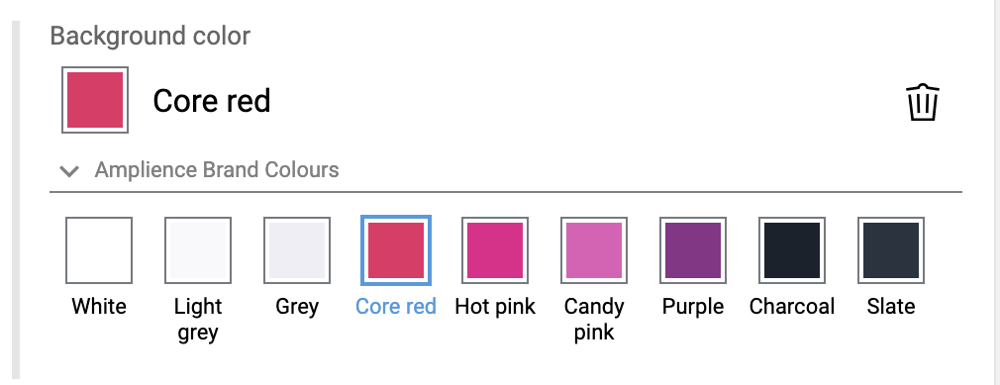

[](https://amplience.com/dynamic-content)



# Dynamic Content Brand Colours Extension

This extension allows users to pick colours from a predefined set of brand colours in some content item. This makes it easier to pick colours relevant to the brand's identity, rather than freely entering any colour and having to copy/paste the values around.

The field title and brand colours you desire are passed in via a parameter:

```json
"params": {
  "title": "Heading Colour",
  "contentID": "1f279ce8-bd84-4313-aa8c-02e853cc4ebd"
}
```

A selected brand colour is stored in the final content item as a string literal containing that colour. Colours can be referenced by either name or literal value, the former being useful when you feel you might change a colour in the future. There is no other identifying information or linking - so a change to an existing brand colour will not update any existing assignments. Also as a result, when there are two identical colours in the set, the extension will *always pick the first name on load!* You have been warned!

## Snippet for Brand Colour Field

The brand colours extension just wraps around a simple string field.

```json
{
  "type": "string",
  "ui:extension": {
    "name": "brand-colours",
    "params": {
      "title": "title",
      "contentID": "id-here"
    }
  }
}
```

If you want to use names rather than the literal colours for values, just include parameter `useNames`:

```json
{
  "type": "string",
  "ui:extension": {
    "name": "brand-colours",
    "params": {
      "title": "title",
      "contentID": "id-here",
      "useNames": true
    }
  }
}

The included content schema also lets you split colours into named groups. You can pass in a paramater to select a selection of groups to display the colours for:

`"groups": ["Header", "Common", "Footer"]`

Omitting this parameter will show all colours in the content item.

```

## Development and QA with GitHub Pages

You can easily try out this UI extension by adding it to your repository with the above snippet, and using the build found at https://amplience.github.io/dc-extension-brand-colours/index.html as the url.

If you've set up your own fork, you can host your own changes on it with gh-pages to make development, experimentation and QA easier.

Build and publish to the `gh-pages` branch using `npm run publish`. If you are using remotes, you can target one with `--remote <name>`. See `gh-pages --help` for more options.

Push the `gh-pages` branch to your fork, and then enable github pages on the repository, and you should be all set.

## Storybook

This project uses storybook to allow visual testing and development of the components in a few example contexts. You can start the storybook server by running `npm run storybook`.

## Brand Colours Schema

The schema for the palette content item that this consumes is included as `brandColours.json`. Install it in DC, create some brand colour content items so that you can point this extension at them.

## Development server

Run `ng serve --ssl` for a dev server. Navigate to `https://localhost:4200/`. The app will automatically reload if you change any of the source files.

If you want to test on DC, you'll need to link an extension to that same localhost url. Keep in mind that you might run into a browser security issue when using SSL, so if you're having any issues visit the extension directly and accept any ssl warnings.

## Angular CLI Tips

### Code scaffolding

Run `ng generate component component-name` to generate a new component. You can also use `ng generate directive|pipe|service|class|guard|interface|enum|module`.

### Build

Run `ng build` to build the project. The build artifacts will be stored in the `dist/` directory. Use the `--prod` flag for a production build.

### Further help

To get more help on the Angular CLI use `ng help` or go check out the [Angular CLI README](https://github.com/angular/angular-cli/blob/master/README.md).
